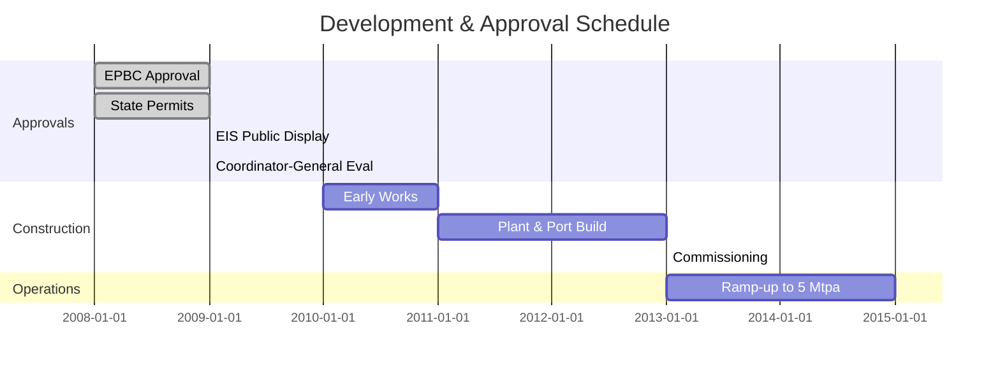

# Feasibility Study – Executive Summary  

*Generated: 07 Aug 2025 • Consolidated from internal sources and prior studies*  

---

## 1. Project Snapshot  

| Item | Detail |
|---|---|
| **Location** | Weipa, Western Cape York, QLD (Australia) |
| **Leases** | Andoom – Special Bauxite Mining Lease ML7024 (plus ML6024) |
| **Development Window** | 2008–2020 (baseline 2008–2013) |
| **Mine Life** | ~20 years |
| **Mining Method** | Open-pit; truck-and-shovel |
| **Target Market** | China (primary); global demand supports base case |
| **Regulatory Regime** | EPBC Act; Water Resources Act; Sea Dumping Act; QLD EPA & SDPWO Act |
| **Key Agreements** | Western Cape Communities Co-existence Agreement (WCCCA) |

---

## 2. Executive Summary  

- Environmental and operational approvals substantially secured (2008–2013); pathway defined for remaining permits.  
- Phased ramp-up aligns with portfolio strategy; minimizes early capital exposure.  
- NPV (10% DR) positive across modeled sensitivities.  
- IRR ~15% (above 12% hurdle).  
- CAPEX ~US$500M initial; OPEX competitive versus peers.  
- Break-even targeted within five years of first production.  
- 20-year LOM supported by reserve models and optimization studies.  

---

## 3. Finance  

| Metric | Value | Notes |
|---|---|---|
| Discount rate (base) | 10% | Risk-adjusted |
| NPV (10%) | Positive | See sensitivities |
| IRR | ~15% | Above hurdle |
| CAPEX | US$300M (detail), US$500M total incl. contingency | 10% contingency |
| OPEX | US$50/t | Benchmarked to peers |
| Break-even volume | 3 Mtpa | Scenario analysis |

*Sensitivity analysis indicates resilience to price, FX, and cost shocks.*  

---

## 4. Strategic Alignment  

- Tier-1 brownfield expansion in Rio Tinto Aluminium – Weipa hub.  
- Supports goals for reserve replacement, portfolio optimization, and ESG leadership.  
- Leverages existing port and road infrastructure; ~10% incremental share capture potential.  
- Aligned with Rio Tinto Environmental & Communities Standards and *The Way We Work*.  

---

## 5. Regulatory & Approvals  

**Federal**  
- EPBC Act approvals (Commonwealth waters and MNES).  
- Sea Dumping Act consent for marine works.  

**State (Queensland)**  
- SDPWO Act coordination; QLD EPA licenses for Environmentally Relevant Activities.  
- Coordinator-General oversight; design acceptances obtained.  

**Stakeholder Framework**  
- WCCCA provides engagement and social-license structure.  
- EIS program (initiated 2008) with specialist providers across environment and heritage.  

---

## 6. Business Structure  

- **Entity:** Rio Tinto Alcan (100% ownership; no JVs).  
- **Leases:** ML7024 (tidal wharf works), ML6024 (harbor rights).  
- Clear governance and decision rights; balanced capital structure and diversified funding.  

---

## 7. Resources & Reserves  

| Category | Tonnes (Mt) | Grade (% Al₂O₃) | Contained Metal (Mt) | Cut-off (%) | Density (t/m³) | Confidence | Notes |
|---:|---:|---:|---:|---:|---:|---|---|
| Measured | 100 | 45.0 | 45 | 30.5 | — | High | Dense drill grid |
| Indicated | 200 | 42.5 | 85 | 30.5 | — | Moderate | Geo-model validated |
| Inferred | 50 | 40.0 | 20 | 30.5 | — | Low | Further drilling required |
| Proven | 80 | 44.0 | 35 | 30.5 | — | High | Core sampled |
| Probable | 120 | 43.0 | 52 | 30.5 | — | Moderate | Reserve models |

*Estimation follows JORC 2012 guidance with block modeling and geostatistical validation.*  

---

## 8. Risks & Mitigations  

| Risk Class | Key Exposure | Mitigation |
|---|---|---|
| High (III–IV) | Marine Protected Areas; EPBC-listed species | Route optimization; offsets |
| High (III–IV) | Outload equipment failure | Redundant design; regular NDT |
| High (III–IV) | Demand volatility (China) | Diversified offtake; price hedging |
| Moderate (II) | Ground conditions / mobility | Bearing-capacity testing; design margins |
| Moderate (II) | Weather delays | Historical weather analytics; berth redundancy |
| Low (I) | Community relations | WCCCA engagement; benefit sharing |

*Risk register reviewed quarterly; owners assigned and residual risk tracked.*  

---

## 9. Development Options & Decision Rationale  

| Scenario | CAPEX | NPV | IRR | LOM | Key Finding |
|---|---|---|---|---|---|
| 5 Mtpa | Base case | ✔︎ | ✔︎ | 20 y | Meets strategic goals with lower risk |
| 10 Mtpa | +30% | ↑ | ↑ | 18 y | Higher value but larger exposure |
| 15 Mtpa | +60% | Highest | Highest | 16 y | Best NPV but capital-intensive |

*Weighted decision matrix indicates 5 Mtpa preferred, balancing value and risk.*  

---

## 10. Technical Overview  

- **Mining:** open-pit; truck-shovel fleet sized via optimization; ~95% recovery.  
- **Processing:** proven bauxite beneficiation; low-complexity, cost-efficient configuration.  
- **Infrastructure:** 50 MW power, 100 km water pipeline, port upgrades (ML7024).  
- **Geotechnical:** stable host; UCS ~150 MPa; minimal seismicity.  

---

## 11. Assumptions & Validation  

| Domain | Key Assumption | Validation |
|---|---|---|
| Market | US$50/t bauxite | Historical trends; expert consensus |
| Discount rate | 10% | WACC + risk premium |
| Inflation | 2% CPI | Government data and internal forecasts |
| Recovery | 95% | Pilot trials; benchmarks |

*Sensitivity tests (±20%) show robust NPV; contingency plans in place.*  

---

## 12. Timeline (2008–2013 Key Milestones)  

---
